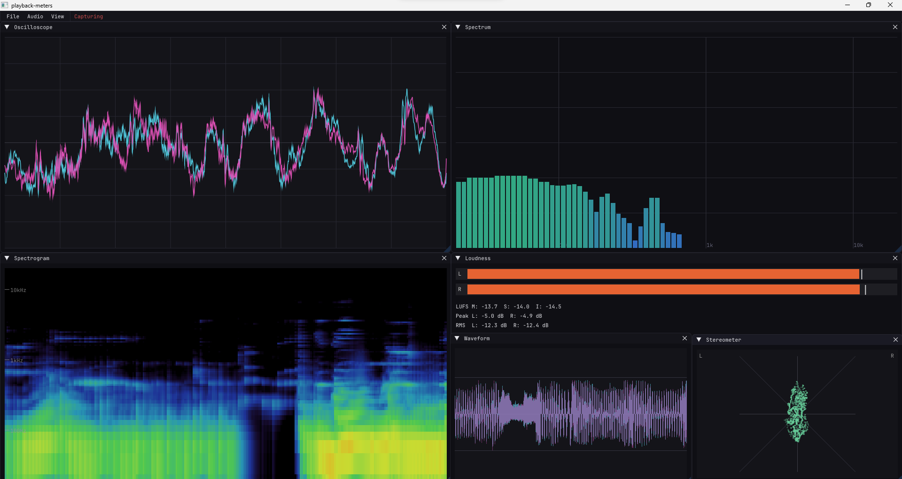

# playback-meters

realtime playback audio visualization (MiniMeters clone) built with ImGui + WASAPI + kissFFT

  

## features

- **metering modules**: oscilloscope, spectrum, spectrogram, loudness, stereometer, VU meter, waveform
- **WASAPI Audio Capture**: low-latency system audio loopback and input capture
- **real-time visualization**: 60+ FPS smooth rendering with ImGui

## license

MIT License
